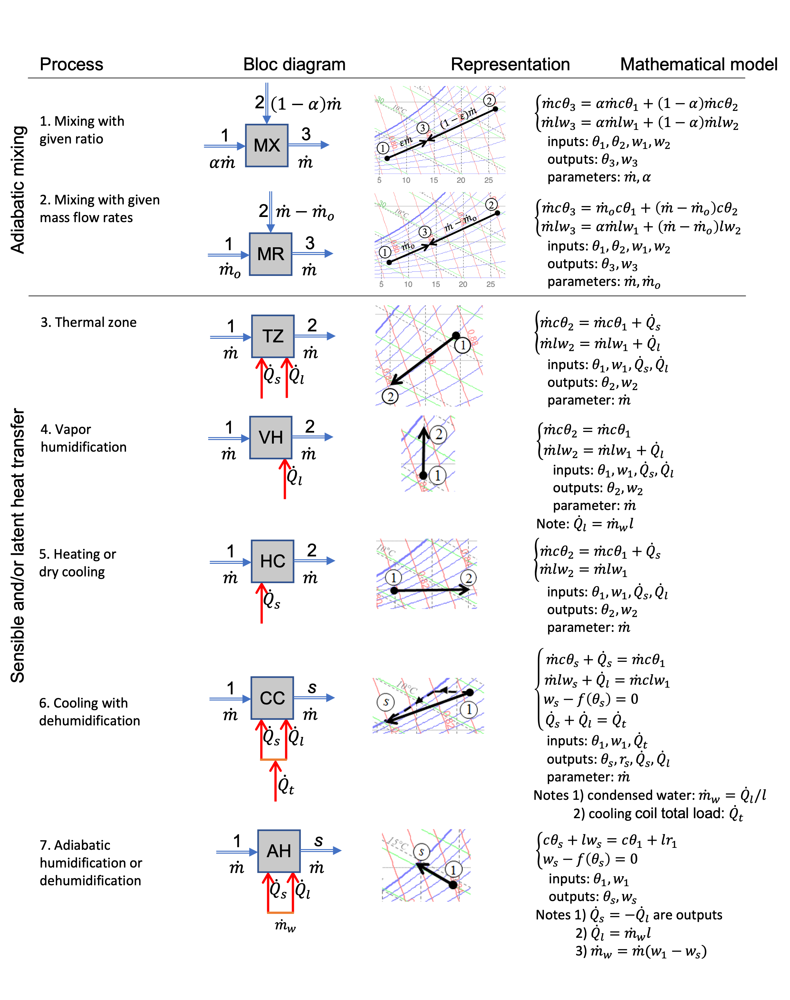

# PsychroAn_tuto - Computational psychrometric analysis of HVAC systems: tutorials

 Launch the whole repository.

**Contents**

*Interactive web pages (using Voilà)*
1.  `T01_moist_air_prop.ipynb` Moist air properties.
2.  `T02_loads_winter.ipynb` Thermal loads: winter.
3.  `T03_mix.ipynb` Adiabatic mixing and isentalpic condensation.
4.  `T04_va_hum.ipynb` Heating and vapor humidification.
5.  `T05_ad_hum.ipynb` Heating and adiabatic humidification.
6.  `T06_cool` Cooling with dehumidification.

The models presented in the tutorials are formed by a system of equations constructed with blocks of elementary processes ([Ghiaus 2022](https://hal.archives-ouvertes.fr/hal-03484064/document)).
> Table. Models of the elementary processes ([Ghiaus 2022](https://hal.archives-ouvertes.fr/hal-03484064/document)).
> 

**Bibliography**

Ghiaus, C. (2014). Linear algebra solution to psychometric analysis of air-conditioning systems. *Energy, 74*, 555-566. DOI: [10.1016/j.energy.2014.07.021](https://doi.org/10.1016/j.energy.2014.07.021)

Ghiaus, C. (2016). Analyse psychrométrique des systèmes de climatisation. *Revue générale du Froid & du Conditionnement d’air*, pp.38-42. [hal-03379788](https://hal.archives-ouvertes.fr/hal-03379788/document)

Ghiaus, C. (2021). PsychroAn_cool: Psychrometric analysis of cooling systems as a control problem. In Journal of Building Performance Simulation (0.0.0, Vol. 15, Number 1, pp. 21–38). *Zenodo*. DOI: [10.5281/zenodo.5236450](https://doi.org/10.5281/zenodo.5236450)

Ghiaus, C. (2022) Computational psychrometric analysis as a control problem: case of cooling and dehumidification systems, *International Journal of Building Performance Simulation, 15*(1), pp. 21-38, DOI: [10.1080/19401493.2021.1995498](https://doi.org/10.1080/19401493.2021.1995498), (open access preprint [hal-03484064](https://hal.archives-ouvertes.fr/hal-03484064/document))

